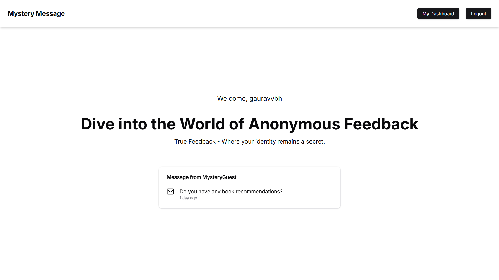
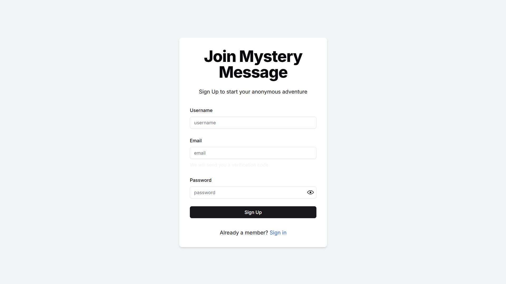
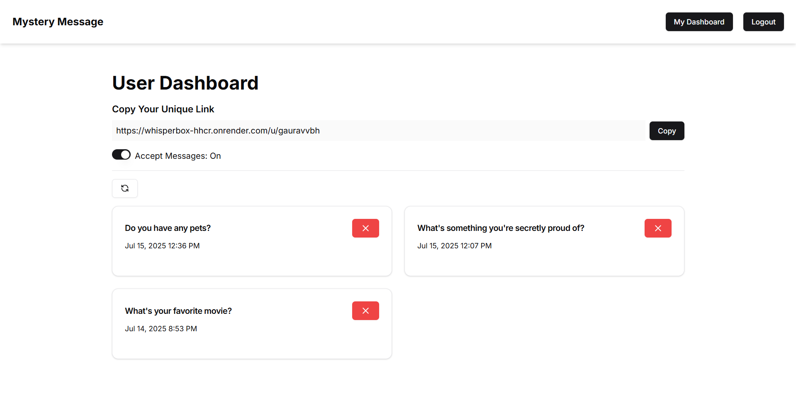
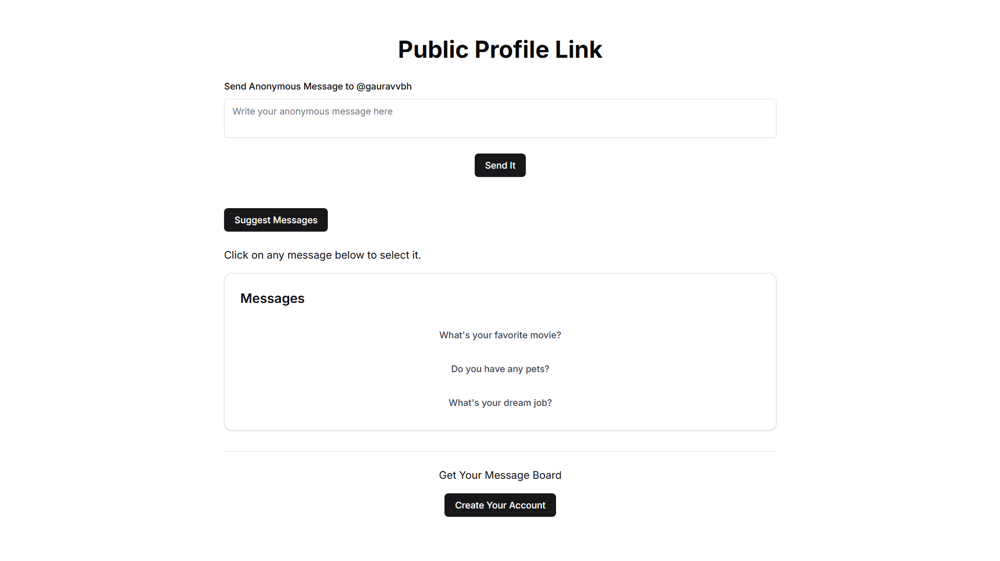

# ✉️ Mystery Message

> A full-stack web app to send and receive anonymous messages, enhanced with AI features using Google Gemini. Built with Next.js, MongoDB, and NextAuth.

This is a full-stack website built using the Next.js framework with TypeScript. For the frontend UI, we use Radix, Shadcn, Lucid-react, Embla for the carousel, and React Hook Form. Authentication is handled by NextAuth.js with an OTP system managed by Email System, and we use Zod for validation. Additionally, we have integrated generative AI features.

The website allows users to send anonymous messages to anyone registered on the platform. Users can register using their email and username, and upon successful registration, they can access their dashboard to view all received messages. Each user is also provided with a unique link that allows others to send them anonymous messages.

By visiting the unique link, users will find an input field where they can type and send messages anonymously to the registered user. Below the input field, there is a section with sample questions that users can choose to send if desired.


---

## 🌟 Features

-  User registration with **email verification**  
-  Secure authentication with **NextAuth**  
-  Extended session & JWT with custom fields (`isVerified`, `isAcceptingMessages`, `username`)  
-  Toggle to enable/disable **accepting anonymous messages**  
-  Receive, view, and delete anonymous messages in a **personal dashboard**  
-  Responsive and accessible UI with **Radix UI, Lucide icons, and TailwindCSS**  
-  Real-time toast notifications (custom implementation inspired by react-hot-toast)  
-  Uses **Google Gemini AI API** to power AI-enhanced features (e.g., suggestions, moderation, etc.)  
-  Protected routes via Next.js middleware  

---

## 🧰 Tech Stack

- 🖥️ **Frontend**
  - [Next.js](https://nextjs.org/)
  - [React](https://react.dev/)
  - [TailwindCSS](https://tailwindcss.com/)
  - [Radix UI](https://www.radix-ui.com/)
  - [Lucide Icons](https://lucide.dev/)

- 🗄️ **Backend**
  - [Next.js API Routes](https://nextjs.org/docs/api-routes/introduction)
  - [MongoDB + Mongoose](https://mongoosejs.com/)
  - [NextAuth](https://next-auth.js.org/)
  - [Nodemailer](https://nodemailer.com/about/)
  - [Google Gemini AI](https://ai.google.dev/)

- 🧪 **Other Libraries**
  - [Zod](https://zod.dev/) – validation
  - [React Hook Form](https://react-hook-form.com/) – form management
  - [Day.js](https://day.js.org/) – date formatting
  - [clsx](https://github.com/lukeed/clsx) + [tailwind-merge](https://tailwind-merge.org/) – class merging
  - [Axios](https://axios-http.com/) – HTTP client

---

## 🚀 Getting Started

### 1️⃣ Clone the repo

```bash
git clone https://github.com/your-username/mystery-msg.git
cd mystery-msg
```
### 2️⃣ Install dependencies
```
npm install
```
### 3️⃣ Environment Variables
Create a `.env.local` file in the root:

```env
# MongoDB
MONGODB_URI=your-mongodb-uri

# NextAuth
NEXTAUTH_SECRET=your-nextauth-secret
NEXTAUTH_URL=http://localhost:3000

# JWT
JWT_SECRET=your-jwt-secret

# Gmail SMTP (for verification emails)
GMAIL_USER=your-gmail@gmail.com
GMAIL_PASS=your-app-password

# Google Gemini AI
GEMINI_API_KEY=your-google-gemini-api-key
```

---
## 🧪 Run Locally
```bash
npm run dev
```

Visit: `http://localhost:3000`

---

## 🛠️ Build for Production
```bash
npm run build
npm start
```

---

## 📄 Environment Variables Explained

| Variable         | Description                                   |
|------------------|-----------------------------------------------|
| `MONGODB_URI`    | MongoDB connection string                     |
| `NEXTAUTH_SECRET`| Secret key for NextAuth session encryption    |
| `NEXTAUTH_URL`   | App URL (e.g., `http://localhost:3000`)       |
| `JWT_SECRET`     | JWT signing secret for NextAuth               |
| `GMAIL_USER`     | Gmail account (sender) for verification emails|
| `GMAIL_PASS`     | Gmail app password (use an App Password)      |
| `GEMINI_API_KEY` | Google Gemini AI API key                      |

---

## 🖼️ Screenshots

### 🔷 Home Page
> Starting page of the app.



### 🔷 Registration Page
> User registration form.



### 🔷 User Dashboard
> Logged-in user dashboard with all received messages and controls.



### 🔷 Public Anonymous Messaging Page
> Unique link page where anyone can send anonymous messages.



---

## 📚 Learn More

- [Next.js Documentation](https://nextjs.org/docs)
- [NextAuth Documentation](https://next-auth.js.org/getting-started/introduction)
- [Mongoose Documentation](https://mongoosejs.com/docs/)
- [Google Gemini API](https://ai.google.dev/)
- [Radix UI Primitives](https://www.radix-ui.com/primitives/docs/overview/introduction)

---

## 🙌 Contributing

Contributions, issues and feature requests are welcome!  
Feel free to open a pull request or submit an issue.

---

## 📝 License

MIT License — see the [LICENSE](LICENSE) file for details.

---

## 👨‍💻 Author

Developed by Gaurav.  
Feel free to reach out!
